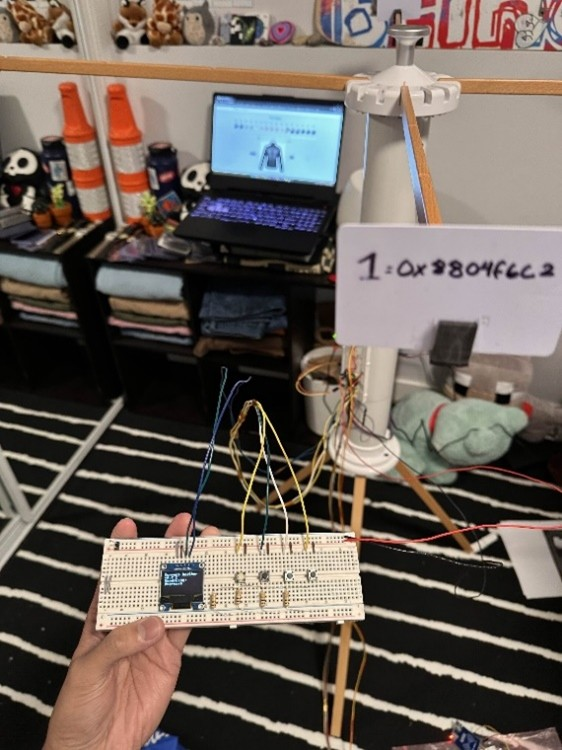

# Fit-O-Matic - Smart Closet System (Capstone Project)

## Project Overview
The Fit-O-Matic is a **smart closet system** developed as a *collaborative capstone project* (CMPE2965 - Technical Project) in the NAIT Computer Engineering Technology program. It combines a web application and hardware components to help users make outfit decisions using real-time data from an external API.

The repository has been recreated for *portfolio purposes*.

  

  <em>Final assembled Fit-O-Matic prototype (hardware subsystem developed by a team member).</em>

## Tech Stack

  
  
  
  
  

## Architecture & Integrations
- ASP.NET Core (Razor Pages) - Web application framework for structuring pages and handling server-side rendering
- ADO.NET with parameterized queries - Secure database access and execution of SQL queries against Azure SQL Database
- REST API Integration - Retrieval of real-time weather data from Open-Meteo and communication with the hardware system
- Azure SQL Database - Cloud-hosted relational database for application data
- JSON data handling - Parsing and processing API responses

## Key Features
- Displays hourly weather conditions through a web interface
- Enables users to control and interact with the hardware-based closet system through both a web interface and a physical controller board
- Lets users browse an outfit catalog and view the currently selected outfit on the web interface 
- Allow users to update and manage the clothing inventory in the closet system

## My Contributions
- Developed application logic using C# and Javascript for both frontend and backend functionality
- Implemented data access layer using ADO.NET with parameterized queries for secure database operations
- Built interactive web features for viewing weather data, browsing outfits, and inventory management
- Developed communication flow between the web application and the hardware controller system

## Hardware Components

The hardware subsystem was developed by a separate team member and is included for *system context only*.

- Raspberry Pi Pico W
- Motorized rotating closet rack system
- NFC-based clothing identification system using tagged clothing rungs

## Project Images

## Acknowledgements
Hardware design and implementation were primarily completed by Andreas Delfin (https://www.linkedin.com/in/andreas-kizzer-delfin/) as part of the Fit-O-Matic capstone project team.
