# Fit-O-Matic — Smart Closet System Capstone Project (2024)

## Project Overview
The Fit-O-Matic is a **smart closet system** developed as a *collaborative capstone project* (CMPE2965 - Technical Project) in the NAIT Computer Engineering Technology program. It combines a web application and hardware components to help users make outfit decisions using real-time data from an external API.

This repository has been recreated and structured for *portfolio demonstration purposes*.

<p align="center">
  
  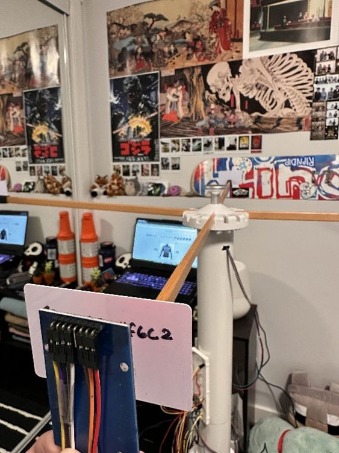
</p>
<p align="center">
  <em>Final assembled Fit-O-Matic prototype (hardware subsystem developed by a team member).</em>
</p>

## Presentation
Left: Vidal Gonzalo  

Right: Andreas Delfin


https://github.com/user-attachments/assets/d9fd6446-1168-45e6-b077-6e99cda0291c


## Tech Stack
<p>
  
  
  
  
  
</p>

## Architecture & Integrations
- ASP.NET Core (Razor Pages) - Web application framework for structuring pages and handling server-side rendering
- ADO.NET with parameterized queries - Secure database access and execution of SQL queries against Azure SQL Database
- REST API Integration - Retrieval of real-time weather data from Open-Meteo and communication with the hardware system
- Azure SQL Database - Cloud-hosted relational database for application data
- JSON data handling - Parsing and processing API responses

## Key Features
- Displays hourly weather conditions through a web interface
- Enables users to control and interact with the hardware-based closet system through both a web interface and a physical controller board
- Lets users browse an outfit catalog and view the currently selected outfit on the web interface 
- Allow users to update and manage the clothing inventory in the closet system

## My Contributions
- Built and styled web interface features for weather data display, outfit catalog browsing, and inventory management

  - *Web interface showing state changes during outfit catalog interaction and inventory updates.* <br>
<p align="center">
  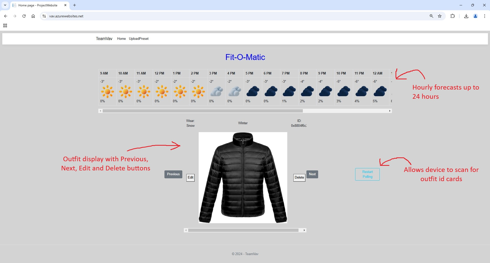
  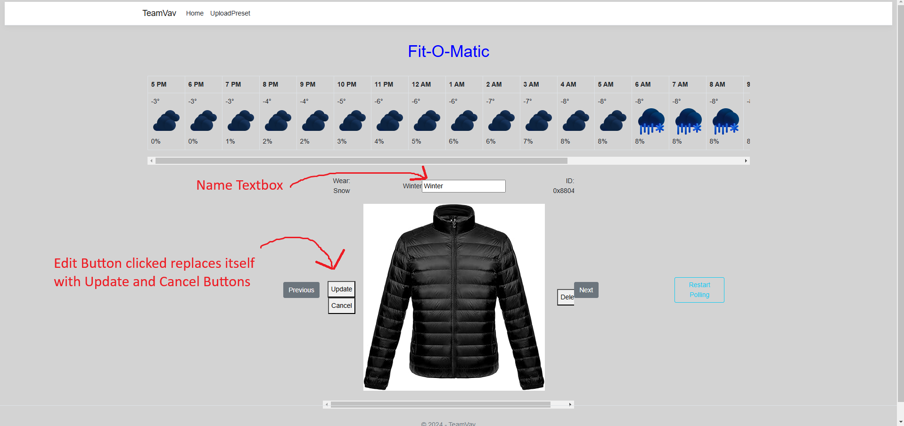
  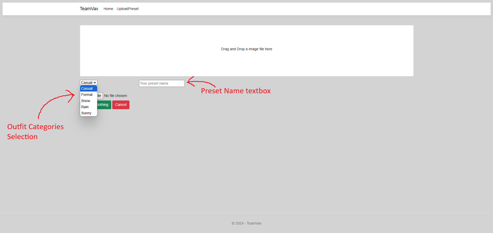
  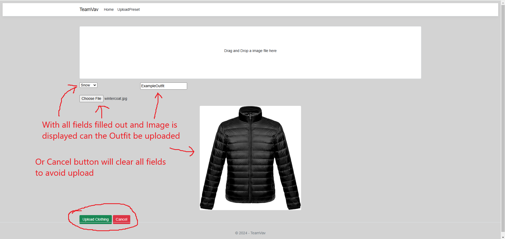  
</p>

- Developed application logic using C# and JavaScript for both frontend and backend functionality
  - Internal System AJAX (frontend -> backend) - After Update Btn is pressed on UploadPreset Page

  ```js
   function UpdatePreset()
  {
    let presetName = $("#presetTBX").val();
    console.log("Updated preset name saved " + presetName);
    console.log($("#presetStatus").val());

    let updateData = {};
    updateData["presetID"] = $("#presetStatus").val();
    updateData["presetName"] = presetName;
  
    // ServerAJAX  
    ServerAJAX(projectURL + "UpdatePreset", "post", updateData, "json", ServerSuccess, Error);

    // after call reset back to editBtn functionality
    $(this).off();

    $(this).prop("id", "editBtn");

    $(this).text("Edit");

    $(this).on("click", EditPreset);

    $("#cancelBtn").remove();

    $("#presetTBX").remove();   // remove the textbox
  }
  ```
  ServerAJAX Helper Function
  ```js
  /*******************************************************************************************************
   Description: Server call to send data converted to JSON to the project webservice. 
   Params: projectURL - Project URL
          method - GET or POST data
          reqData - weather info is stored in this data object's properties
          dataType - retrieve information in JSON or HTML format
          successMethod - success function to be executed
          errorMethod - error function on error
   ********************************************************************************************************/
   function ServerAJAX(url, method, reqData, dataType, successMethod, errorMethod) {
     let ajaxOptions = {};

     ajaxOptions['url'] = url;                                           // the target website to send the call
     ajaxOptions['method'] = method;                                     // GET OR POST
     ajaxOptions['data'] = reqData ? JSON.stringify(reqData) : null;     // data object to obtain
     ajaxOptions['dataType'] = dataType;                                 // JSON or HTML format
     ajaxOptions['contentType'] = "application/json";                    // NEW for C#

     let con = $.ajax(ajaxOptions);

     // on Successful call of successMethod
     con.done(successMethod);

     // on Failure call errorMethod
     con.fail(errorMethod);
     }
   ```
  
  - External API AJAX (weather data)
    ```js
    /******************************************************************************************************
    Description: Get Edmonton's weather and to make sense of the OpenMeteo's documentation.             
    Params: None
    Returns: N/A
    *******************************************************************************************************/
    function GetEDMWeather() {
      console.log("Inside GetWeather: ");

      let url = "https://api.open-meteo.com/v1/forecast";

      // create the data object to retrieve weather information
      let data = {};
      data['latitude'] = 53.5461;
      data['longitude'] = -113.4937;
      data['elevation'] = '645';
      data['hourly'] = "temperature_2m,weather_code,precipitation_probability,is_day";
      data['timezone'] = "America/Edmonton";
      data['current'] = "temperature_2m,is_day,weather_code,precipitation_probability";

      AJAX(url, "get", data, "JSON", WeatherSuccess, Error);     // make AJAX call to openmeteo weather api
    }
    ```
  
- Implemented a data access layer using ADO.NET with parameterized queries for secure database operations
  
    ADO.NET database update logic (Snippet)
    ```csharp
    public static class UserControls
      // connection string to the database
      static string connection = "PUT_YOUR_CONNECTION_STRING_HERE";

      public static int UpdatePreset(string PresetID, string PresetName)
      {
          using (SqlConnection conn = new SqlConnection(connection))
        {
            try
            {
            conn.Open();
            Trace.WriteLine("Connection is open");

            string updatePresetQuery = "Update Presets set PresetName = @presetName " +
                                        "where PresetID = @presetID";

            int rowsAffected = 0;

            using (SqlCommand command = new SqlCommand(updatePresetQuery, conn))
            {
                command.CommandType = CommandType.Text;

                command.Parameters.AddWithValue("@presetName", PresetName);
                command.Parameters.AddWithValue("@presetID", PresetID); 

                rowsAffected = command.ExecuteNonQuery();
            }

            conn.Close();

            return rowsAffected;
          }
          catch (Exception ex)
          {
            Trace.WriteLine(ex);
            Trace.WriteLine(ex.Message);
            return 0;
          }
      }
    }
    ```
    
- Designed and implemented the API endpoint routing enabling communication between the web application, database, and hardware controller system
  <p align="center">
  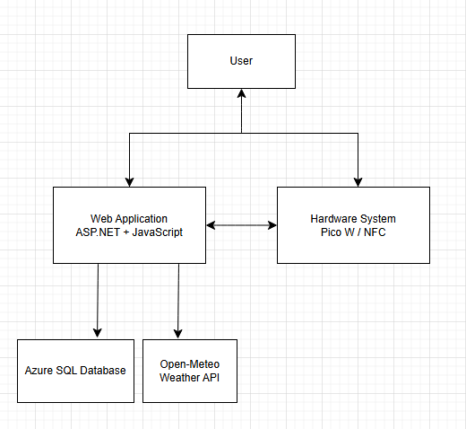
  </p>
  <p align="center">
    <em>System FlowChart</em>
  </p>

## Hardware Components

This section highlights the primary hardware components used in the Fit-O-Matic system to support embedded input/output and system integration.

<table>
  <tr>
    <td align="center">
      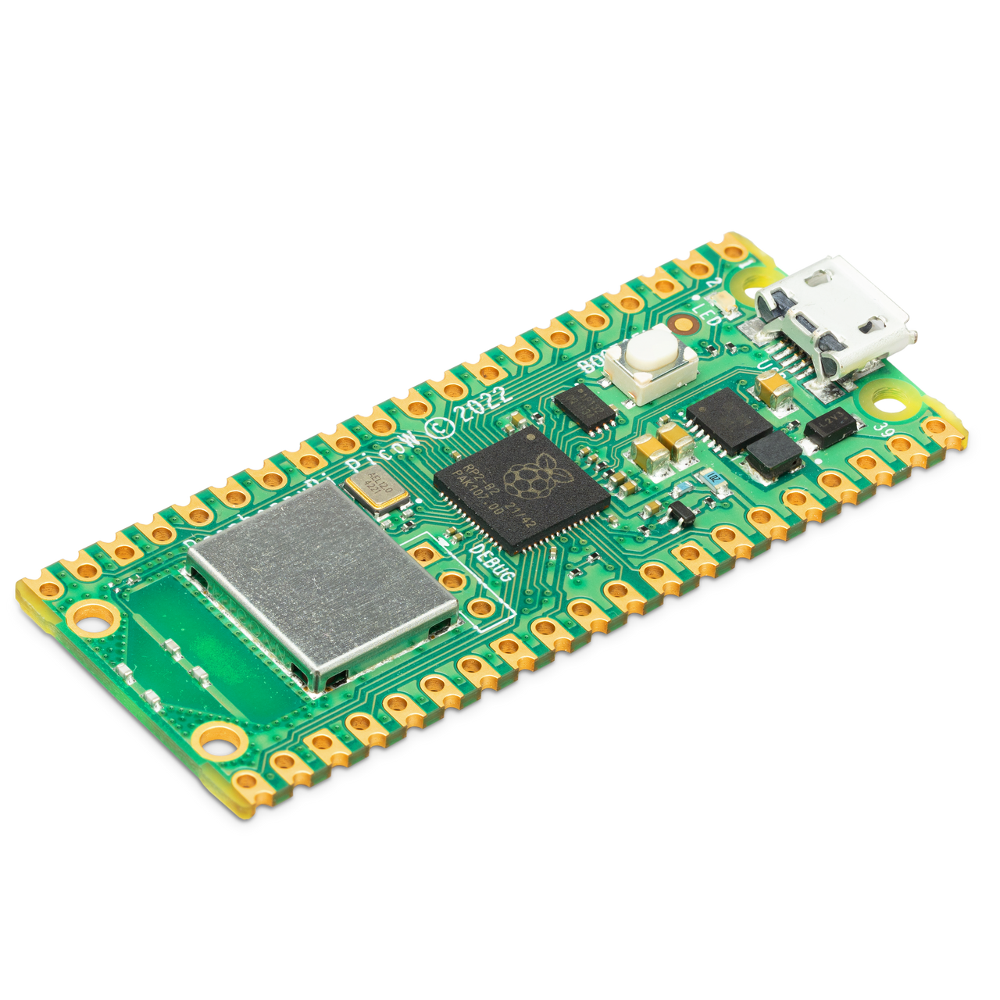<br>
       Raspberry Pi Pico W
    </td>
    <td align="center">
      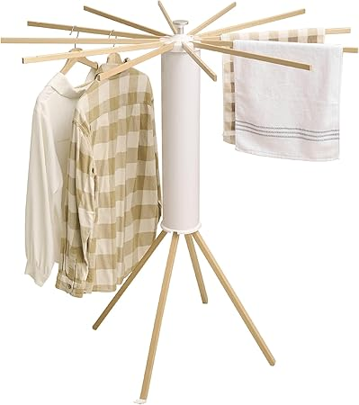<br>
      Closet rack structure
    </td>
    <td align="center">
      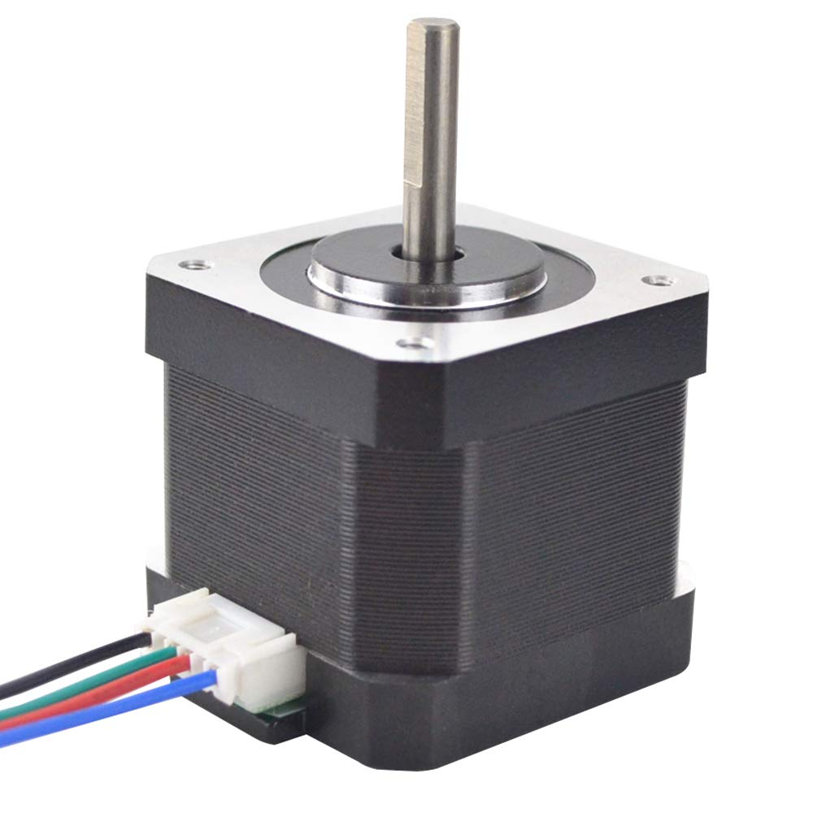<br>
      Nema17 motor
    </td>
    <td align="center">
      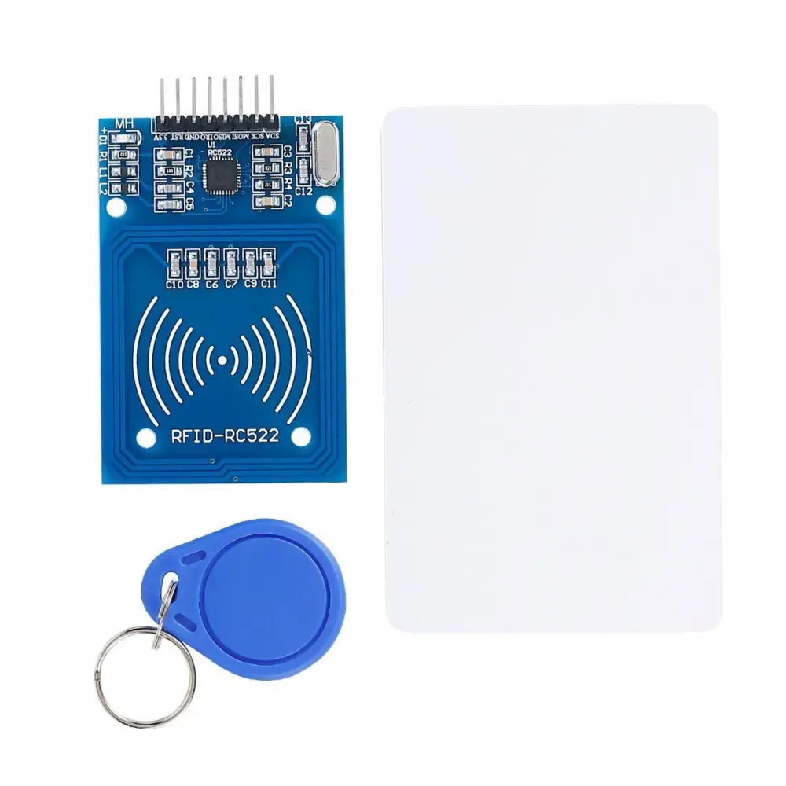<br>
      NFC RFID Reader + NFC Tags
    </td>    
  </tr>
  <tr>
    <td align="center">
      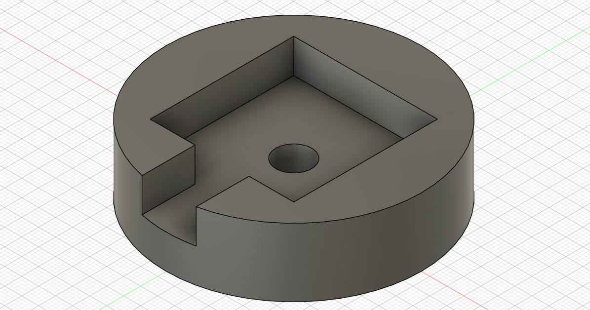
      Motor Housing TopView
    </td>
    <td align="center">
      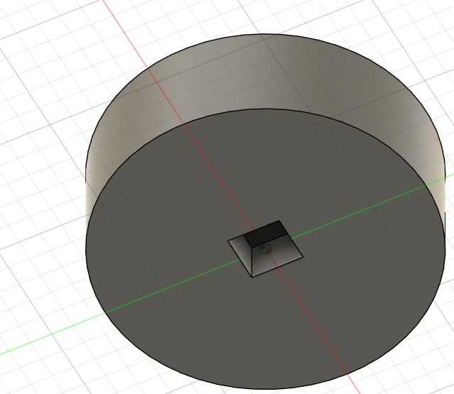
      Motor Housing BottomView
    </td>
    <td align="center">
      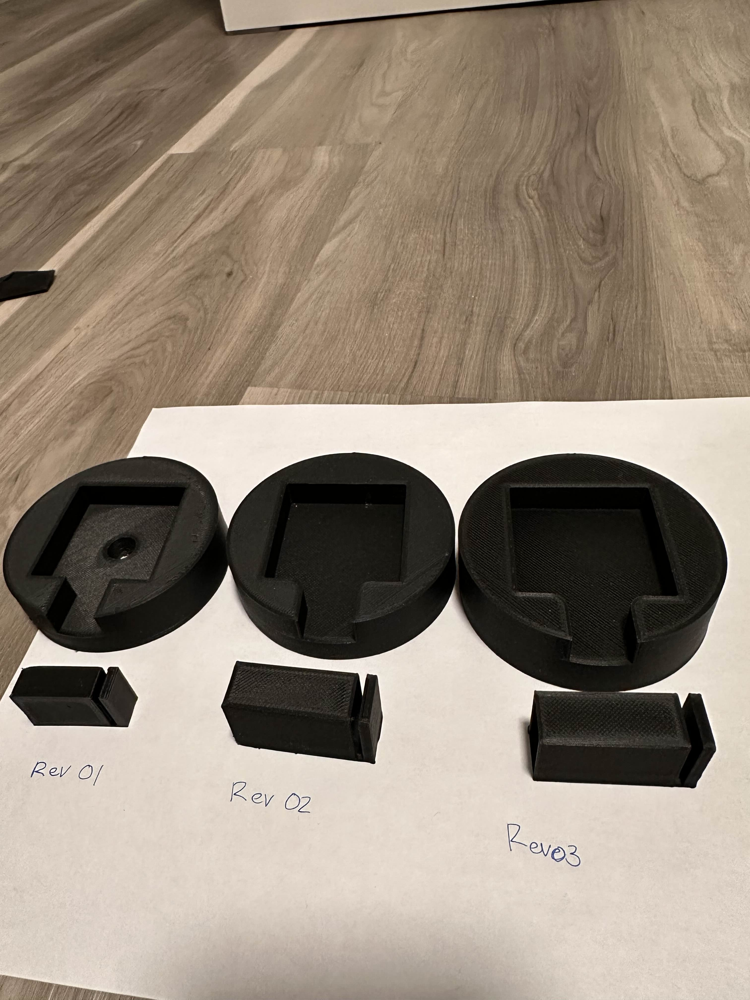
      Motor Housing Revisions
    </td>
    <td align="center">
      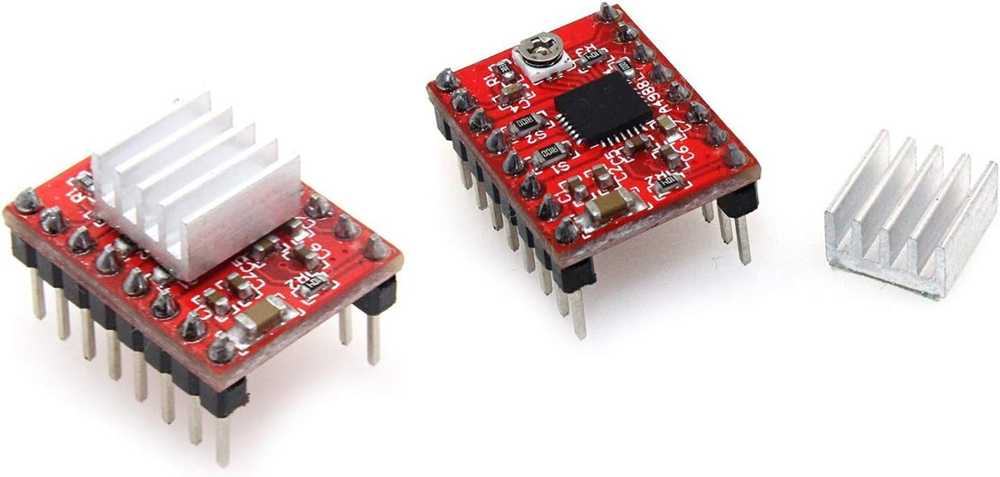
      A4988 Stepper Motor Driver
    </td>
  </tr>
</table>

<h3 align="center">BreadBoard Controller</h3>
<p align="center">
  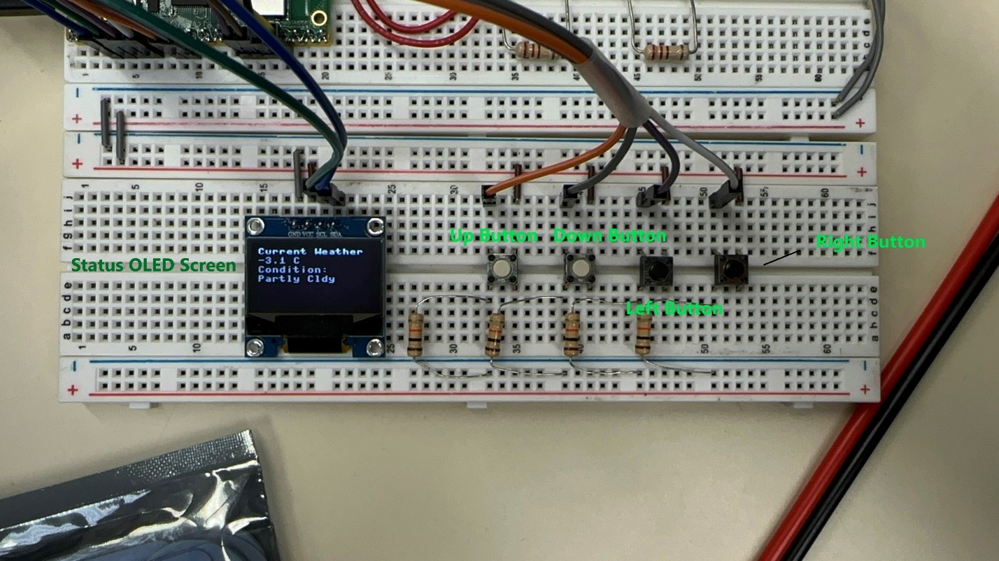
  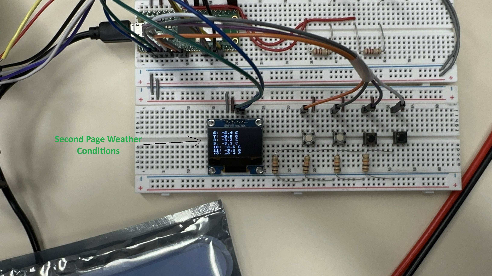
  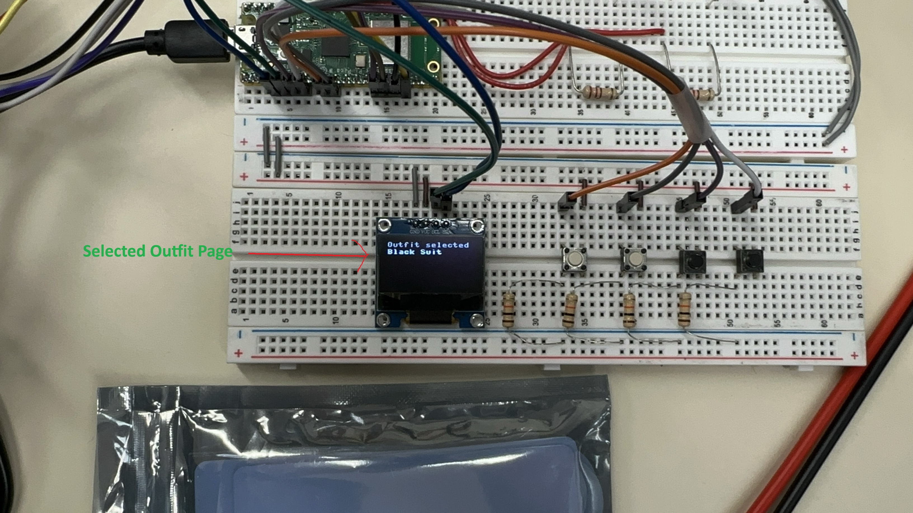
</p>

## Acknowledgements
Hardware design and implementation were completed by Andreas Delfin as part of the Fit-O-Matic capstone project.

LinkedIn: https://www.linkedin.com/in/andreas-kizzer-delfin/

## Contact
Author: Vidal II Gonzalo

LinkedIn: https://www.linkedin.com/in/vidal-gonzalo-2nd/
